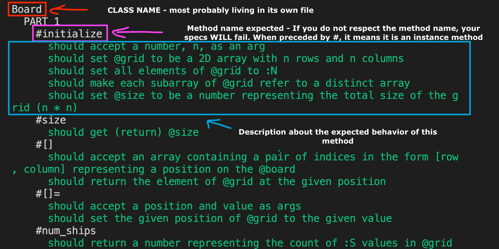

+ ## How to read Rspec specs 

+ ## Define a class with an initialize method that expects arguments and correctly create a new instance of that class.
+ ## Given RSpec specs, define class and instance variables that pass the specs

+ ## Use attr_reader, attr_writer, attr_accessor, to deliberately allow access to instance variables.

+ ## Define custom bracket methods #[], #[]= on a class.

+ ## Initialize a two-dimensional array with given dimensions such that each subarray is distinct in memory.

+ ## Given an n*n two-dimensional array and a symbol, write a method that returns a boolean indicating whether or not the given symbol has completely filled up any row, column, or diagonal of the grid.

+ ## Given specs, implement a method to read user input for a player's turn during gameplay (such as hangman, battleship, mastermind, etc.).

+ ## Given specs, implement a method to switch turns during two-player gameplay (such as battleship, tic-tac-toe, etc.).

